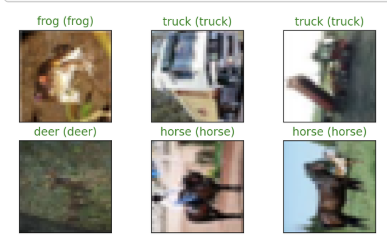
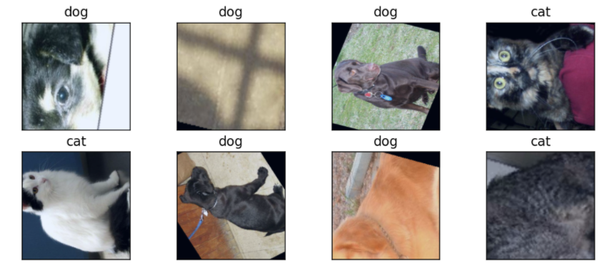
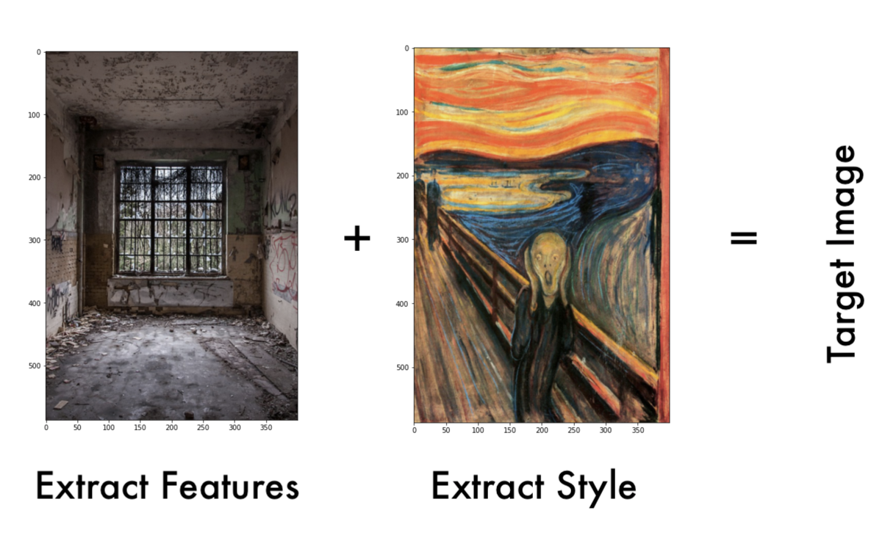
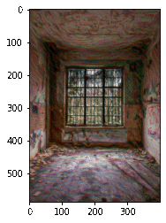
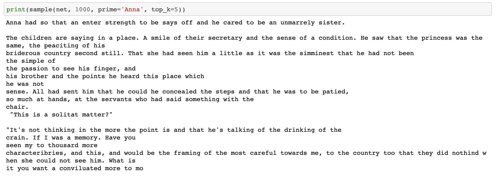

# The Machine Learning Playbook 📕

## Introduction

This is a collection of useful code, programs, notes and much more on machine learning. My goal is to practice and demonstrate my understanding of foundational, intermediate and advanced concepts in machine learning by building it all from scratch!

### The Mathematics Behind Neural Networks

To begin with, ["The Mathematics Behind Neural Networks"](https://github.com/MustafaKhan670093/Machine-Learning-Playbook/blob/master/The%20Mathematics%20Behind%20Neural%20Networks%20-%20By%20Mustafa.pdf) outlines my understanding of how NNs work as well as includes a demonstration of taking the foundtional mathematics and [programming a NN from scratch in Python](https://github.com/MustafaKhan670093/Machine-Learning-Playbook/blob/master/Making_A_NN_From_Scratch.ipynb). 

  

### Dense NNs and Multi-Layer Perceptrons (on MNIST and Fashion MNIST Datasets)

Next, I made a [Dense NN](https://github.com/MustafaKhan670093/Machine-Learning-Playbook/blob/master/Handwritten%20MNIST%20(Dense%20NN)%20ML%20Project.ipynb) that could classify hand written digits on MNIST and then redid the same project but with a [MLP network](https://github.com/MustafaKhan670093/Machine-Learning-Playbook/blob/master/Handwritten%20MNIST%20(MLP)%20ML%20Project.ipynb). I also made an [MLP](https://github.com/MustafaKhan670093/Machine-Learning-Playbook/blob/master/Fashion%20MNIST%20(MLP)%20ML%20Project.ipynb) that could distinguish between the classes in the Fashion MNIST dataset.

   

### Convolutional Neural Networks

Developing my understanding of Convolutional Neural Networks by creating a CNN model architecture and using it to [classify objects](https://github.com/MustafaKhan670093/Machine-Learning-Playbook/blob/master/Image%20Classification%20Using%20A%20CNN%20(CIFAR-10%20Dataset).ipynb) found in the CIFAR-10 Dataset. A future goal is to create a mathematical document outlining how CNN works as well as an implementation completely from scratch in order to test this understanding. 

   

### Transfer Learning
I [used](https://github.com/MustafaKhan670093/Machine-Learning-Playbook/blob/master/Cat%20and%20Dog%20Classifier%20(Transfer%20Learning).ipynb) the architecture and weights of VGG-16 while modifying the final, classifier layer on a cats and dogs dataset.

   

### Style Transfer

Inspired by the paper: [Image Style Transfer Using Convolutional Neural Networks, by Gatys](https://www.cv-foundation.org/openaccess/content_cvpr_2016/papers/Gatys_Image_Style_Transfer_CVPR_2016_paper.pdf), I [implemented](
https://github.com/MustafaKhan670093/Machine-Learning-Playbook/blob/master/Style%20Transfer%20With%20Deep%20Neural%20Networks.ipynb) Style Transfer. By using gradient descent to optimize a total loss function (made of a content loss and a style loss), the network manages to extract the content of the content image and the style of the style image in order to produce the target image.

   

### RNNs And LSTMs

By creating a network based off of [Andrej Karpathy's post on RNNs](http://karpathy.github.io/2015/05/21/rnn-effectiveness/) that uses LSTMs, I created a model that is able to generate new text based on text samples or inputs. In this case, I [trained the model](https://github.com/MustafaKhan670093/Machine-Learning-Playbook/blob/master/Character%20Level%20LSTM.ipynb) on Anna Karenina by Leo Tolstoy. The following is an output of the model after being trained:

   

