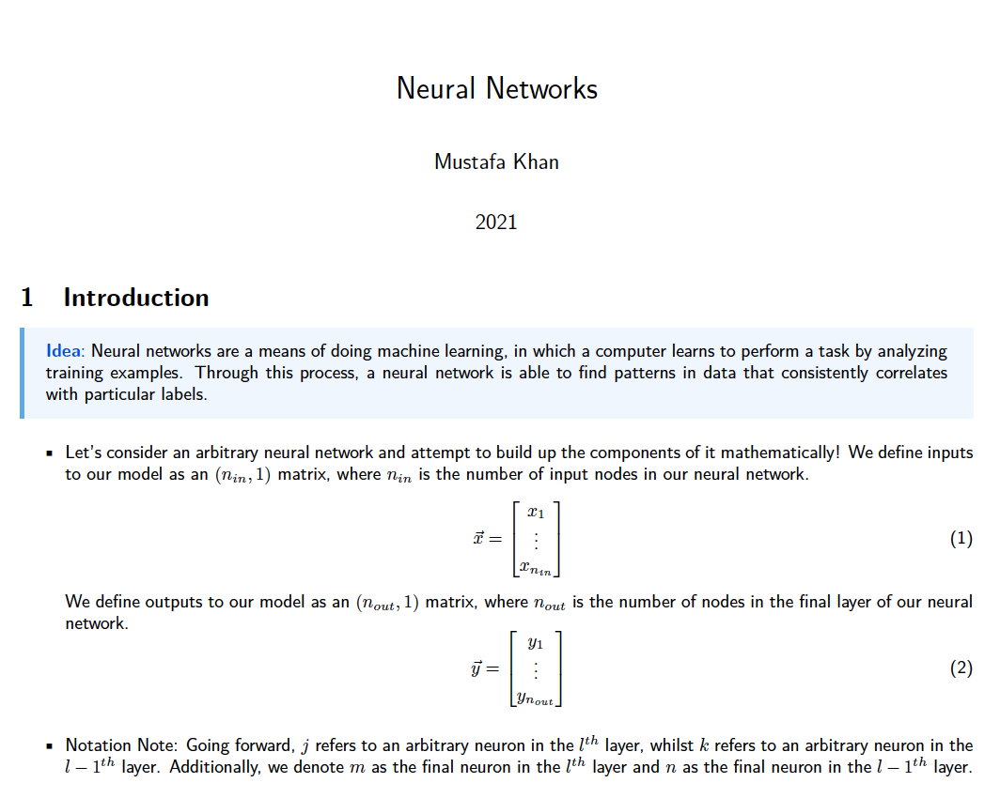
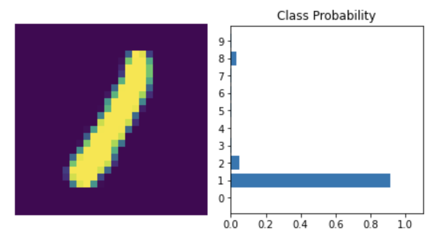
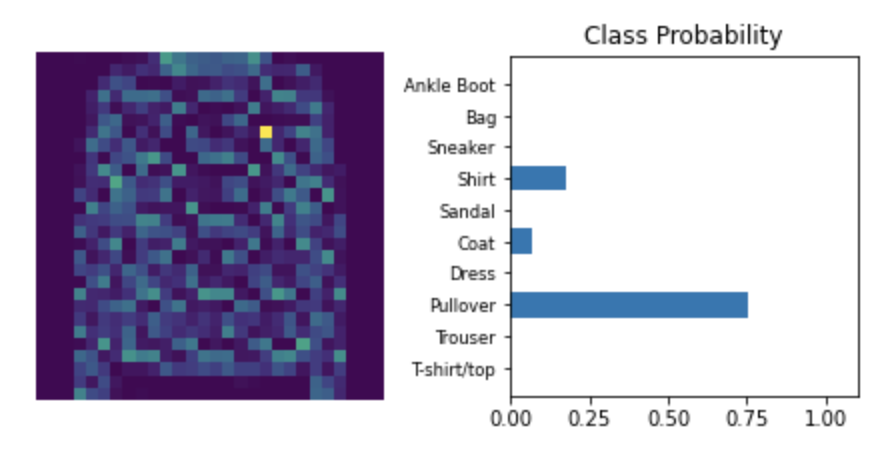

# The Machine Learning Playbook 📕

## Introduction

This is a collection of useful code, programs, notes and much more on machine learning. My goal is to practice and demonstrate my understanding of foundational, intermediate and advanced concepts in machine learning by building it all from scratch!

### The Mathematics Behind Neural Networks

To begin with, ["The Mathematics Behind Neural Networks"](https://github.com/MustafaKhan670093/Machine-Learning-Playbook/blob/master/The%20Mathematics%20Behind%20Neural%20Networks%20-%20By%20Mustafa.pdf) outlines my understanding of how NNs work as well as includes a demonstration of taking the foundtional mathematics and [programming a NN from scratch in Python](https://github.com/MustafaKhan670093/Machine-Learning-Playbook/blob/master/Making_A_NN_From_Scratch.ipynb). 

  

### Dense NNs and Multi-Layer Perceptrons (on MNIST and Fashion MNIST Datasets)

Next, I made a [Dense NN](https://github.com/MustafaKhan670093/Machine-Learning-Playbook/blob/master/Handwritten%20MNIST%20(Dense%20NN)%20ML%20Project.ipynb) that could classify hand written digits on MNIST and then redid the same project but with a [MLP network](https://github.com/MustafaKhan670093/Machine-Learning-Playbook/blob/master/Handwritten%20MNIST%20(MLP)%20ML%20Project.ipynb). I also made an [MLP](https://github.com/MustafaKhan670093/Machine-Learning-Playbook/blob/master/Fashion%20MNIST%20(MLP)%20ML%20Project.ipynb) that could distinguish between the classes in the Fashion MNIST dataset.

   

### Fashion MNIST
